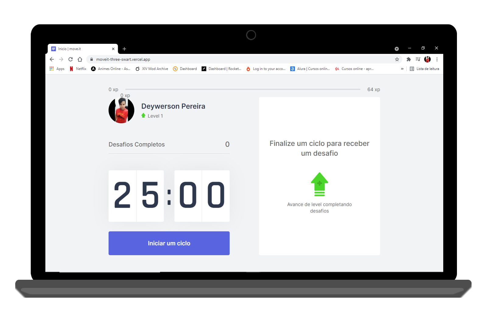
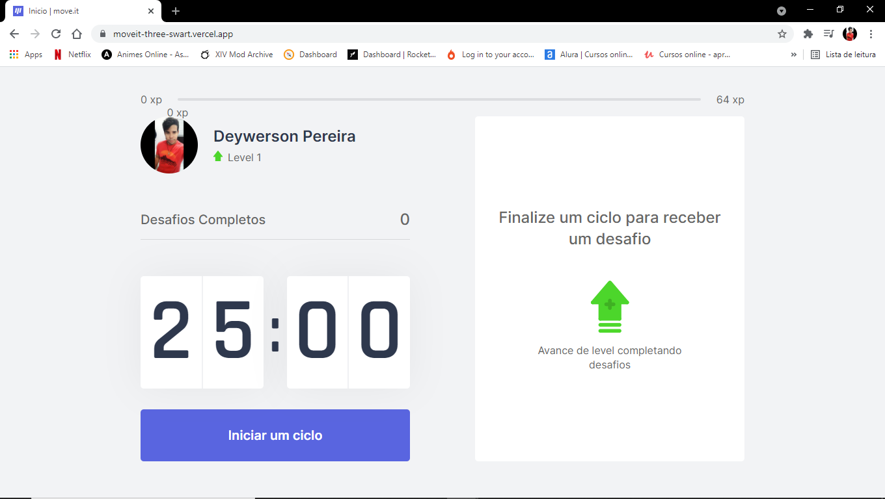
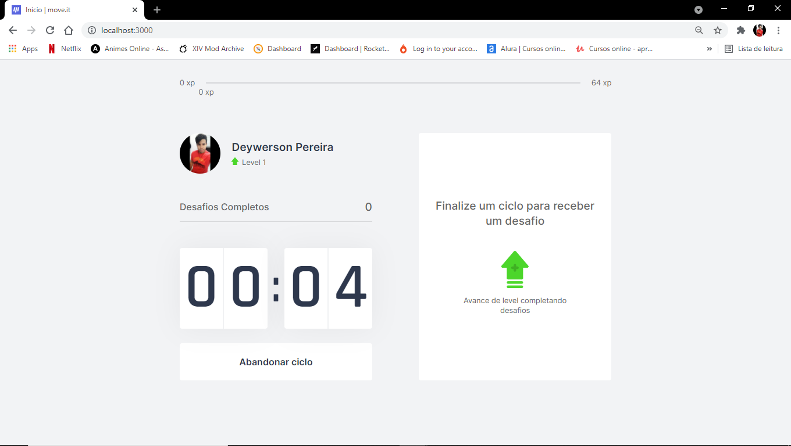
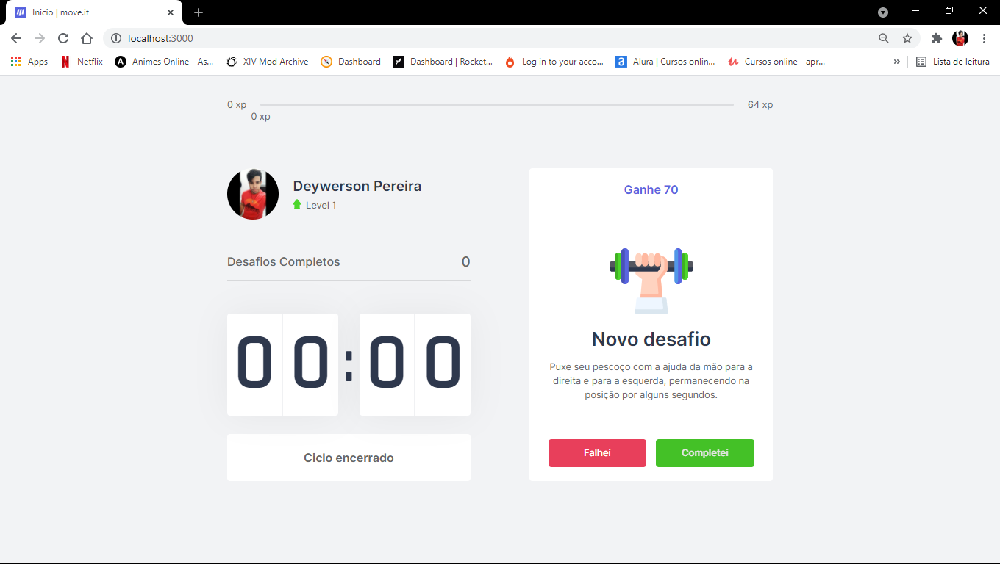
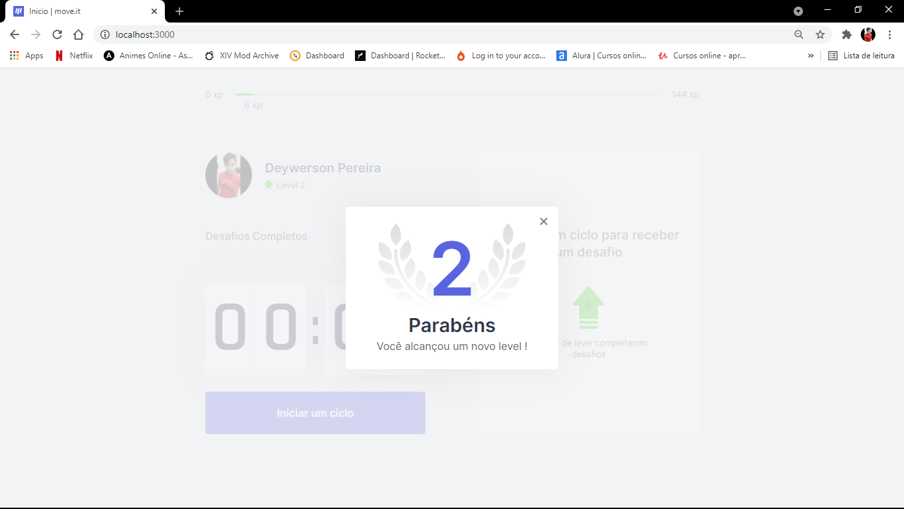
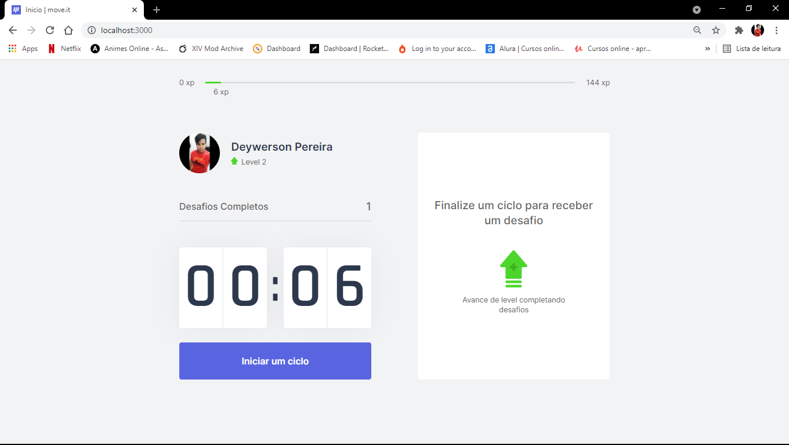

<h1 align="center">
  
</h1>

  <a href="#-project">Project</a>&nbsp;&nbsp;&nbsp;|&nbsp;&nbsp;&nbsp;
  <a href="#-technologies">Technologies</a>&nbsp;&nbsp;&nbsp;|&nbsp;&nbsp;&nbsp;
  <a href="#-services-used">Services Used</a>&nbsp;&nbsp;&nbsp;|&nbsp;&nbsp;&nbsp;
  <a href="#-getting-started">Getting Started</a>&nbsp;&nbsp;&nbsp;|&nbsp;&nbsp;&nbsp;
  <a href="#-how-to-use">How To Use</a>&nbsp;&nbsp;&nbsp;|&nbsp;&nbsp;&nbsp;
  <a href="#-features">Features</a>&nbsp;&nbsp;&nbsp;|&nbsp;&nbsp;&nbsp;
  <a href="#-layout">Layout</a>&nbsp;&nbsp;&nbsp;|&nbsp;&nbsp;&nbsp;
  <a href="#memo-license">License</a>

 

  

 

  

## 💻 Project

Move.it is an app that combines [Pomodoro's technique](https://descomplica.com.br/tudo-sobre-carreiras/como-funciona-a-tecnica-pomodoro/?utm_source=ads_google&utm_medium=cpc&utm_campaign=marktech-psq-nonbrand-posgrad-generico&utm_content=destino-blog-artigos-de-melhor-desempenho&utm_term=destino-blog-artigos-de-melhor-desempenho&gclid=CjwKCAjwjJmIBhA4EiwAQdCbxkNELNB0LveMZ8VmpcVP1LBEvp7mScKpdjAG3QbqrUc1pljCNiRI4BoCEZAQAvD_BwE) with physical exercises for those who spend a lot of time in front of the computer.

This application is hosted on Vercel, [click here to see it](https://moveit-three-swart.vercel.app/).

  

## 🚀 Technologies

This project was developed using these techs:

- [React](https://reactjs.org)
- [Next.js](https://nextjs.org/)
- [TypeScript](https://www.typescriptlang.org/)
- [JS Cookie](https://github.com/js-cookie/js-cookie)

 

## 👨‍🔧 Services Used
- GitHub
- [Vercel](https://vercel.com/)

 

## 🎮 Getting Started

If you want run this code, you can start cloning the repository using HTTP or SSH key.

- Open your git
- Type `git clone`
- Insert the HTTP or SSH key (on windows, shift + insert to paste on gitBash)
- You can find this HTTP or SSH Key by clicking on `Code` on the top right in this repository

- Once cloned you can open the project in your IDE and enter the codes below in the IDE terminal

`yarn` To add the dependencies on the project.  

`yarn dev` Runs the app in the development mode.\
Open [http://localhost:3000](http://localhost:3000) to view it in the browser.

  

**Dependencies**
- JS Cookies

 

## 📌 How to Use
### 1 - When you access the project, you will see home page. In this page you can:
#### 1.1 - Start a countdown.

### 2 - When the timer runs out, the challenge box will change, showing a new challenge. 
#### 1.1 - Here we can see the xp amount and what we have to do.

### 3 - Upon completing a challenge, the amount of XP provided will be added to your current XP. If the value exceeds the amount of XP needed, you level up.

### 4 - When you finish a challenge, the amount of completed challenges will be increased by one. If you cancel the challenge that won't happen.

### 5 - Keep applying the Pomodoro's technique and exercising at the end of each countdown!

 

## 🕵 Features

The main features of the application are:
 - Use the Pomodoro's technique
 - Store progress using cookies
 - Start/cancel countdown
 - Show new challenge
 - Complete a challenge
 - Cancel a challenge
 - Level Up
 - Count how many challenges were completed
 
 

## 🔖 Layout

You can see the layout of this project through [this link](https://www.figma.com/file/ge20pu3ofMOKoliUyKx1Nl/Move.it-1.0). It's necessary have an account on [Figma](https://figma.com) to access.

 

## :memo: License

This project is under MIT license.

 

 > In case of sensitive bugs like security vulnerabilities, please contact
 > <a href = "mailto:deywerson.pereira@gmail.com">deywerson.pereira@gmail.com</a> directly instead of using issue tracker. We value your effort
 > to improve the security and privacy of this project!
  
 
---
  

      
Please follow on github and join us! Thanks for visiting me and good coding!

Made with ♥ by <a href="https://github.com/deywersonp">Deywerson Pereira</a>
